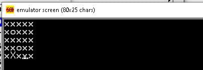

# Descrição #

Uma implementação do jogo campo minado na linguagem assembly.

Esta é uma entrega de trabalho para a disciplina de Arquitetura de Computadores ([Universidade de Caxias do Sul](https://www.ucs.br/)), desenvolvido por [Lucas Facchini](https://github.com/lucasfacchini) and [Adryan Alessandro Signor](https://github.com/AdryanSignor).

# Execução #

Instalar o [Emu8086](https://emu8086-microprocessor-emulator.en.softonic.com/) e colar o código do arquivo `minesweeper.asm` para o editor do emulador.

# Screenshot #

