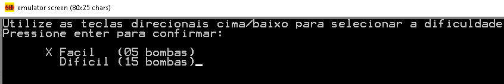
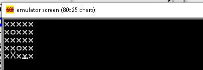

[*Versão em português.*](https://github.com/lucasfacchini/minesweeper8086/blob/master/README-pt.md)

# Description #

An implementation for the minesweeper game in assembly.

This is an assignment submission for Computer Architecture course ([Universidade de Caxias do Sul](https://www.ucs.br/)), made by [Lucas Facchini](https://github.com/lucasfacchini) and [Adryan Alessandro Signor](https://github.com/AdryanSignor).

# Running #

Install [Emu8086](https://emu8086-microprocessor-emulator.en.softonic.com/) and paste the code from `minesweeper.asm` into the emulator editor.

# Screenshot #

